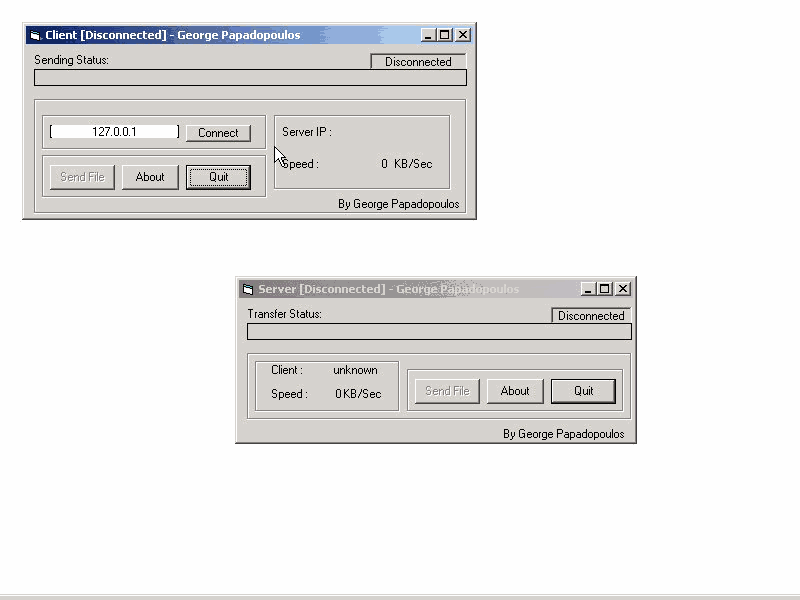



## A Fast File Sender

### Description

File Sender Is A Fast File Transfering Software ( for single threat )..and very easy to use...it shows you how to create a connection using Winsock Control,how to use Common Dialog Control,open/read/write files,send data over the net,how to use functions like split,mid.. or your own functions...anyway..have fun and if you are a member PLEASE RATE MY PROJECT...:)..(don't be suprised from the transfer speed you see in my screenshot..its because i send the 30 mb file local not from the internet..thats why the speed is 1-2 MB/Sec :P )..comments are welcome
 
### More Info
 

             |
---                |---
**Submitted On**   |2001-01-07 12:38:18
**By**             |[George Papadopoulos  \- VirusFree](https://github.com/Planet-Source-Code/PSCIndex/blob/master/ByAuthor/george-papadopoulos-virusfree.md)
**Level**          |Intermediate
**User Rating**    |4.7 (186 globes from 40 users)
**Compatibility**  |VB 5\.0, VB 6\.0
**Category**       |[Internet/ HTML](https://github.com/Planet-Source-Code/PSCIndex/blob/master/ByCategory/internet-html__1-34.md)
**World**          |[Visual Basic](https://github.com/Planet-Source-Code/PSCIndex/blob/master/ByWorld/visual-basic.md)
**Archive File**   |[A\_VERY\_Fas970746202002\.zip](https://github.com/Planet-Source-Code/george-papadopoulos-virusfree-a-fast-file-sender__1-36094/archive/master.zip)

